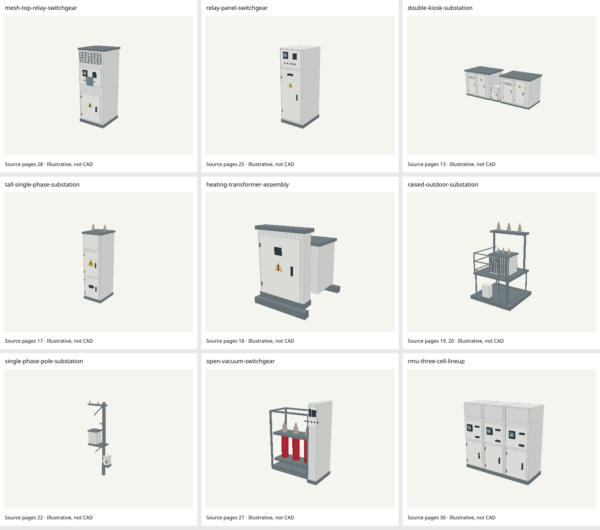
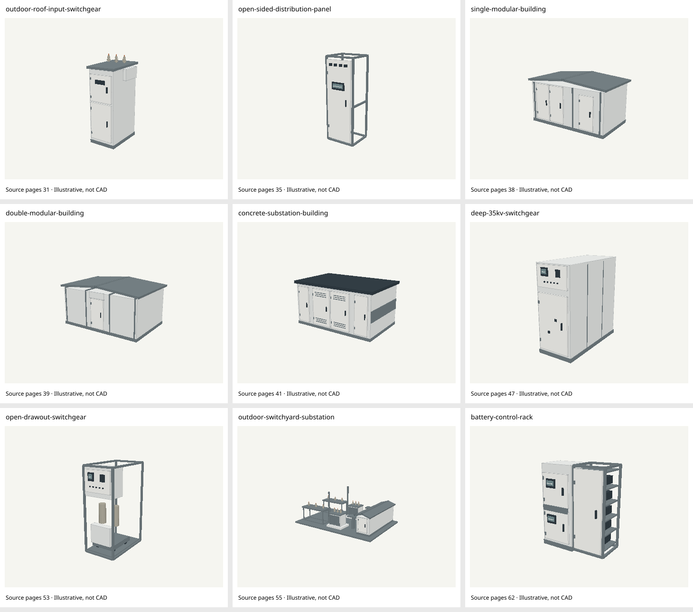
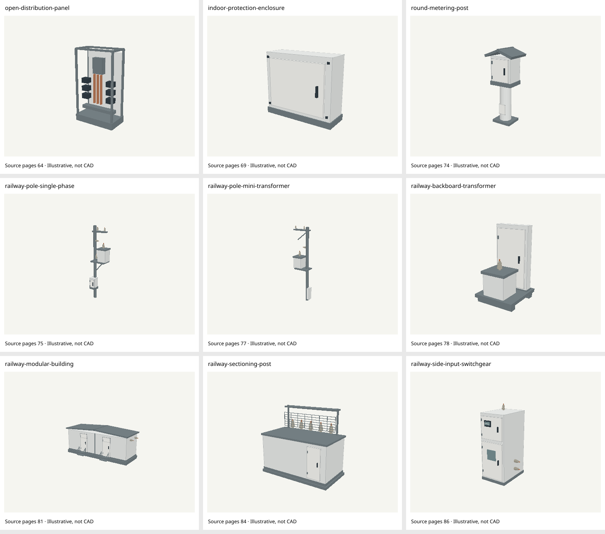
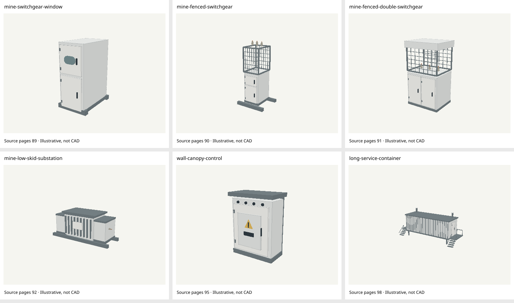

# Original-catalog source-grounded 3D expansion

Reviewed 2026-10-05. Implementation base: PR28 `790692fb0a0a4809c75cab05b6e4e751257a3323`; source/visual baseline: PR27 `4ce6d0fffd19c047ee2427750d965c5447417050`. This report covers the **original 238 independent catalogue records only** and makes no coverage assertion about the new transformer PDF.

## Result

- **33 new shared construction geometries cover 47 formerly unmapped records**
- **1 further record**, aggregate UKZV, reuses the existing overhead-input construction with an explicit mixed-family representative limitation
- Source-matched illustrative 3D: **123 → 171**; generic/unconfirmed 3D remains **14**
- Absent 3D: **101 → 53**: **43 source-only** plus **10 unverified**
- The 53 consist of the same **42 ambiguous source-only/typical-icon rows**, the same **10 unverified rows**, and the **PTM/TDE mixed-construction overview**. None is silently promoted
- All **238 independent identities** and all icons are preserved: **172 source-based, 66 typical**
- Geometry registry: 59 named types plus the generic equipment fallback; 53 constructions are now used by source-matched records

Original crop and full-page pixels were inspected before each construction was built. Pages 47 and 81 were viewed upright; both KTPS pages 19 and 20 and UKZV page93 were inspected. These are illustrative interpretations of visible topology. Arbitrary scene proportions and simplified fittings are **not real dimensions, CAD, electrical schematics or approved SKU-specific models**. Closed exterior sources remain closed. Open/cutaway interpretations are described as such; no hidden wiring or undocumented internals are reconstructed.

## Implementation and evidence boundaries

- `sourceGeometry.js` contains shared construction builders and reusable exterior primitives. It never reads a product, rating, category or record ID
- `sourceConstructions.js` registers 33 reviewed types and a closed 48-record mapping allowlist. All new mappings have inheritance disabled; prior source-matched mappings stay unchanged
- Original imported product records and raster sources, the source-image view, and illustrative/non-CAD labels remain intact
- ATP page81 is a closed building with two doors, plinth and side inputs. The stale exposed-frame prose is removed
- KTPS v007 uses page20 for both model/icon evidence and read-only native-media selection. The family retains its page19 crop
- BKTP v001 uses page38 and single-building geometry; v002 keeps page39 and distinct double-building geometry
- PTM/TDE overview stays unmapped. Separately labeled TDE v013 gets its plain indoor enclosure; PTM v012 keeps the existing canopy enclosure
- UKZV aggregate represents only the pictured overhead-input version of a mixed family. Cable-input v002/v004/v006/v007 stay unmapped
- SHNN and PR/SHR11 represent only the pictured family example; separately named variants are not inferred
- KTPB(K) page55 shows two parallel bays and a separate RU building. Only the reviewed 35kV example/family are enabled; 110/220kV variants remain unresolved
- SHUOT preserves the closed front panel and open right-side shelving seen on page62

## Source constructions

| Construction | Pages | Exact allowed records | Meshes / triangles |
|---|---|---|---|
| mesh-top-relay-switchgear | 28 | kso-292 | 36 / 761 |
| relay-panel-switchgear | 25 | kso-2-10 | 20 / 569 |
| double-kiosk-substation | 13 | cat-2ktpg-25-3150 | 43 / 483 |
| tall-single-phase-substation | 17 | cat-ktpo-4-10, cat-ktpo-4-10-v001, cat-ktpo-4-10-v002, cat-ktpo-4-10-v003, cat-ktpo-4-10-v004 | 28 / 1141 |
| heating-transformer-assembly | 18 | cat-ktpto-80 | 15 / 169 |
| raised-outdoor-substation | 19, 20 | cat-ktps-100-1600, cat-ktps-100-1600-v007 | 94 / 3576 |
| single-phase-pole-substation | 22 | cat-mtpo-4-10 | 37 / 2144 |
| open-vacuum-switchgear | 27 | cat-kso-2-20 | 51 / 2380 |
| rmu-three-cell-lineup | 30 | cat-rmu-ae | 39 / 468 |
| outdoor-roof-input-switchgear | 31 | cat-krn-iv | 31 / 1596 |
| open-sided-distribution-panel | 35 | cat-shnn | 25 / 300 |
| single-modular-building | 38 | cat-bktp-modular-v001 | 19 / 228 |
| double-modular-building | 39 | cat-bktp-modular-v002 | 13 / 156 |
| concrete-substation-building | 41 | cat-bktp-concrete | 32 / 384 |
| deep-35kv-switchgear | 47 | cat-kru-kerneu-35 | 20 / 580 |
| open-drawout-switchgear | 53 | cat-km7m | 32 / 1132 |
| outdoor-switchyard-substation | 55 | cat-ktpb-k, cat-ktpb-k-v001 | 155 / 6892 |
| battery-control-rack | 62 | cat-shuot | 44 / 528 |
| open-distribution-panel | 64 | cat-pr-shr11 | 25 / 300 |
| indoor-protection-enclosure | 69 | cat-ptm-tded-v013 | 8 / 96 |
| round-metering-post | 74 | cat-skip, cat-skip-v001, cat-skip-v002 | 11 / 200 |
| railway-pole-single-phase | 75 | cat-ktpzh-2-4, cat-ktpzh-2-4-v001, cat-ktpzh-2-4-v002 | 42 / 2612 |
| railway-pole-mini-transformer | 77 | cat-mtpzh-1-25-2-5, cat-mtpzh-1-25-2-5-v001, cat-mtpzh-1-25-2-5-v002 | 31 / 2072 |
| railway-backboard-transformer | 78 | cat-mtpzh-10, cat-mtpzh-10-v001 | 17 / 612 |
| railway-modular-building | 81 | cat-atp-2x25 | 52 / 2256 |
| railway-sectioning-post | 84 | cat-psk-27-5, cat-psk-27-5-v001 | 56 / 2712 |
| railway-side-input-switchgear | 86 | cat-kru-27-5 | 32 / 1608 |
| mine-switchgear-window | 89 | cat-kru-rn | 15 / 316 |
| mine-fenced-switchgear | 90 | cat-yakno-6-10 | 72 / 2088 |
| mine-fenced-double-switchgear | 91 | cat-yakno-20 | 71 / 2076 |
| mine-low-skid-substation | 92 | cat-ktpshg | 42 / 1320 |
| wall-canopy-control | 95 | cat-bueskn | 18 / 477 |
| long-service-container | 98 | cat-modular-oil | 99 / 1188 |

Full evidence and all current record mappings: [coverage.json](./coverage.json). The frozen test baseline is `frontend/tests/fixtures/old-catalog-model-baseline.json`. Tests verify every prior mapped record and icon remains unchanged, exactly 48 records gain geometry, and all exclusions remain excluded.

## Media integrity

Both generated media manifests and the backend raster mirror were regenerated with `node scripts/generate-catalog-media.mjs`. Page20 is the only newly referenced old-source raster. Exact package checks: **238 associations, 24 empty, 61 raster assets, 1,539,242 bytes** (page20: 86,498 bytes). Immutable source hashes and exact imported-media matching guard the override; edited or unrelated API rows do not acquire it. No source record is rewritten.

## Validation on the recovered PR28 base

- **31** focused frontend geometry/icon/mapping/media tests passed
- **9** backend native-media tests passed, including KTPS v007 source-hash binding
- **Full `npm run check` passed**: lint, **346** frontend unit tests, and the default **Turbopack production build** (287 static pages)
- Dependencies installed from committed lockfiles using `npm ci --ignore-scripts`; no dependency or lockfile changes
- Every new model has finite vertices/world matrices, longest extent normalized to 2.8 arbitrary scene units, distinguishable geometry, and complete disposal. Maximum: **155 meshes / 6,892 triangles**, below the 180-mesh / 30,000-triangle bounds
- All **33** models were rendered in front and perspective views with a CPU z-buffer over the actual Three.js geometry. All **66** frames are nonblank and unclipped; gallery topology was visually reviewed against the original sources
- **WebGL remains unverified**: Chromium cannot create its process-singleton socket in this executor, including after an earlier supported escalation. CPU previews do not validate GPU shading, interactive controls or browser lifecycle
- The earlier checkout used a sibling dependency symlink and passed webpack only. That limitation is resolved by the fresh local lockfile install and successful default Turbopack build above

Reproduce focused tests:

`node --test frontend/tests/equipment-source-expansion.test.mjs frontend/tests/equipment-models.test.mjs frontend/tests/equipment-visual-map.test.mjs frontend/tests/equipment-icons.test.mjs frontend/tests/catalog-media.test.mjs`

`node --test backend-node/tests/catalog-media.test.js`

`node scripts/generate-catalog-media.mjs --check`

### Render galleries

These are CPU geometry previews, not WebGL screenshots.

Reproduce: `XDG_CACHE_HOME=/tmp node frontend/scripts/audit-source-models-software.mjs /tmp/catalog-model-qa`. On a supported browser executor: `CHROMIUM_EXECUTABLE=/path/to/chromium node frontend/scripts/audit-source-models.mjs /tmp/catalog-webgl-qa`. The second command must actually succeed before claiming WebGL QA.

## Still unresolved

The following 53 IDs retain a null model and source-only/unverified state. Additional family/variant-matched exterior evidence is needed; a navigation category, rating or existing icon cannot establish 3D evidence.

- `cat-ktpp-2ktpp-250-6300`: source-only
- `cat-grsh-04`: unverified
- `cat-shnn-v001`: source-only
- `cat-shnn-v002`: source-only
- `cat-shnn-v003`: source-only
- `cat-shnn-v004`: source-only
- `cat-shnn-v005`: source-only
- `cat-shnn-v006`: source-only
- `cat-shnn-v007`: source-only
- `cat-shnn-v008`: source-only
- `cat-shnn-v009`: source-only
- `cat-shnn-v010`: source-only
- `cat-shnn-v011`: source-only
- `cat-shnn-v012`: source-only
- `cat-shnn-v013`: source-only
- `cat-shnn-v014`: source-only
- `cat-shnn-v015`: source-only
- `cat-shnn-v016`: source-only
- `cat-shnn-v017`: source-only
- `cat-shnn-v018`: source-only
- `cat-bktp-modular`: source-only
- `cat-ktpb-k-v002`: source-only
- `cat-ktpb-k-v003`: source-only
- `cat-vru`: unverified
- `cat-shsn-04`: unverified
- `cat-pr-shr11-v001`: source-only
- `cat-pr-shr11-v002`: source-only
- `cat-pr-shr11-v003`: source-only
- `cat-yauo`: unverified
- `cat-yauo-v001`: unverified
- `cat-yauo-v002`: unverified
- `cat-rusm-5100-5400`: unverified
- `cat-rusm-5100-5400-v001`: unverified
- `cat-rusm-5100-5400-v002`: unverified
- `cat-ptm-tded`: source-only
- `cat-ptm-tded-v001`: source-only
- `cat-ptm-tded-v002`: source-only
- `cat-ptm-tded-v003`: source-only
- `cat-ptm-tded-v004`: source-only
- `cat-ptm-tded-v005`: source-only
- `cat-ptm-tded-v006`: source-only
- `cat-ptm-tded-v007`: source-only
- `cat-ptm-tded-v008`: source-only
- `cat-ptm-tded-v009`: source-only
- `cat-ptm-tded-v010`: source-only
- `cat-ptm-tded-v011`: source-only
- `cat-bdrm-v010`: source-only
- `cat-bdrm-v011`: source-only
- `cat-shueng`: unverified
- `cat-ukzv-v002`: source-only
- `cat-ukzv-v004`: source-only
- `cat-ukzv-v006`: source-only
- `cat-ukzv-v007`: source-only
